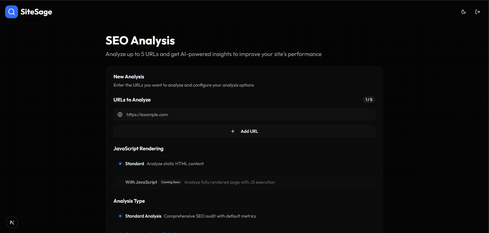
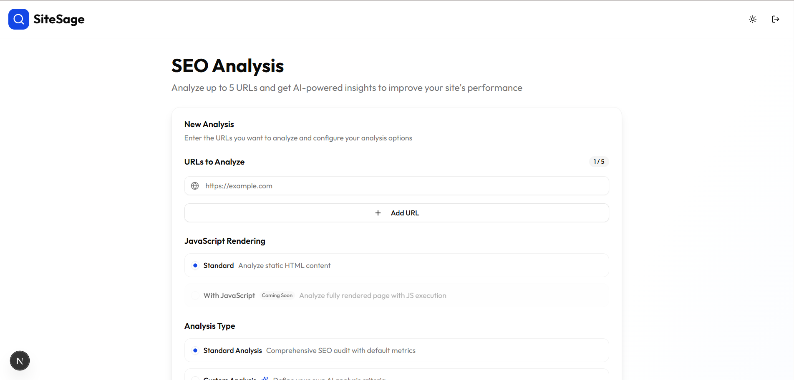
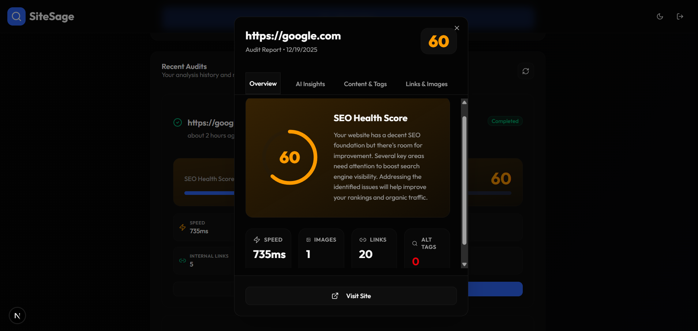
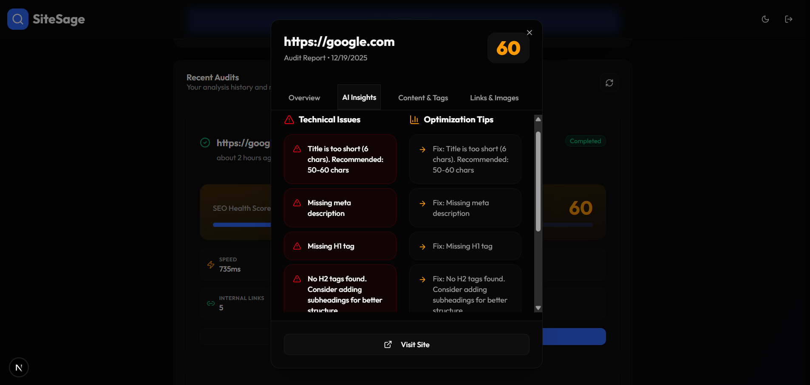
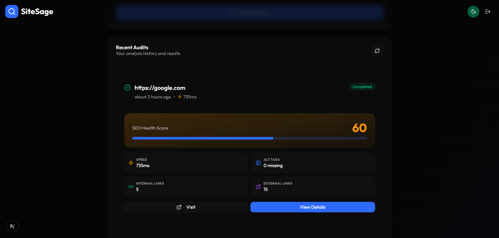

# 🌿 SiteSage - AI-Powered SEO & Performance Analyzer

SiteSage is a modern, high-performance SEO auditing platform that leverages AI to provide deep insights into website performance, accessibility, and search engine optimization. Designed for developers and SEO professionals who want speed and actionable data in a beautiful interface.

**[🌐 Live Demo](https://site-sage-frontend.vercel.app/)**

---

## ✨ Features

- **🚀 Multi-URL Analysis**: Analyze up to 5 URLs simultaneously with asynchronous processing.
- **🤖 AI-Powered Insights**: Get intelligent, contextual recommendations powered by advanced language models.
- **🛠️ Custom Analysis Modes**: Choose between standard audits or define your own custom AI analysis criteria for specific needs.
- **📊 Detailed SEO Metrics**: Comprehensive scoring for performance, accessibility, SEO, and best practices.
- **📱 Fully Responsive**: Optimized for all devices, from desktop workstations to mobile phones.
- **🌓 Dark Mode Support**: A premium, tech-forward interface that looks stunning in both light and dark modes.
- **⏱️ Fast & Reliable**: Built with modern web technologies for a smooth, lag-free experience.

---

## 📸 Interface Preview

### Dashboard Overview
Explore your SEO landscape with a clean, intuitive dashboard.

*SiteSage Dashboard - Dark Mode*


*SiteSage Dashboard - Light Mode*

### Deep Analysis & Scores
Get granular scores and detailed metric breakdowns for every URL.

*Detailed Metric Scoring*

### AI Insights
Let the AI explain what's wrong and how to fix it in plain English.

*AI-Generated Optimization Strategies*

### Results History
Keep track of all your past audits in a sleek card view.

*Audit History Management*

---

## 🛠️ Tech Stack

- **Framework**: [Next.js](https://nextjs.org/) (App Router)
- **Styling**: [Tailwind CSS v4](https://tailwindcss.com/)
- **Components**: [Radix UI](https://www.radix-ui.com/) & [Lucide Icons](https://lucide.dev/)
- **Fonts**: [Outfit](https://fonts.google.com/specimen/Outfit) (Primary), Inter, Montserrat
- **Testing**: [Jest](https://jestjs.io/) & [React Testing Library](https://testing-library.com/docs/react-testing-library/intro/)
- **CI/CD**: [GitHub Actions](https://github.com/features/actions)
- **Deployment**: [Vercel](https://vercel.com/)

---

## 🧪 Quality Assurance

### Testing
SiteSage is built with reliability in mind. We use **Jest** and **React Testing Library** to ensure components behave as expected.
- **Unit & Integration Tests**: Running tests on core components like `AuditCard` to verify UI logic and data rendering.
- **Run Tests**:
  ```bash
  npm test
  ```

### CI/CD Pipeline
Our automated GitHub Actions workflow ensures every push to `main` is healthy and ready for users.
- **Linting**: Automatic code style verification.
- **Build Check**: Ensures the application compiles correctly.
- **Test Suite**: Automatically runs all Jest tests.
- **Deployment Notification**: A custom notification system that confirms CI success and provides direct links to the Vercel deployment logs and live site.

---

## 🚀 Getting Started

### Prerequisites

- Node.js 20+
- npm

### Installation

1. **Clone the repository**:
   ```bash
   git clone https://github.com/SamuelMasih777/SiteSage-Frontend.git
   cd seo-audit-tool
   ```

2. **Install dependencies**:
   ```bash
   npm install
   ```

3. **Run the development server**:
   ```bash
   npm run dev
   ```

4. **Run Linting**:
   ```bash
   npm run lint
   ```

5. **Build for production**:
   ```bash
   npm run build
   ```

---

## ✒️ Creator

Created and Maintained by **Samuel Masih**

---
